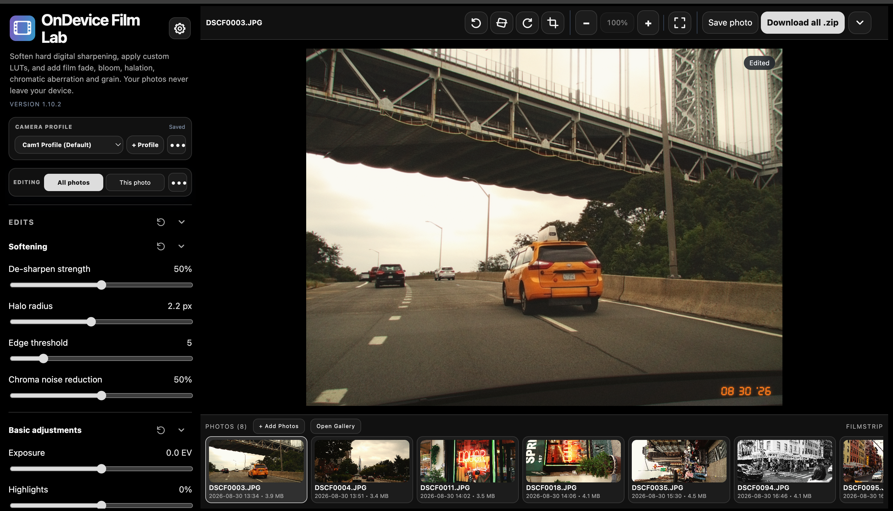
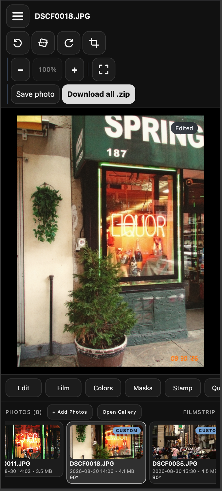
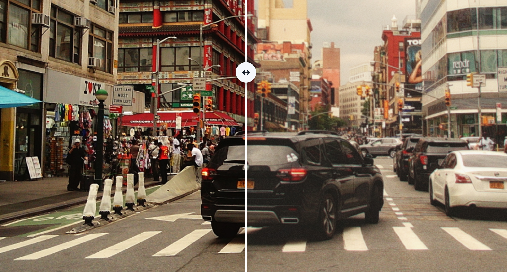

<h1> OnDevice Film Lab</h1>

OnDevice Film Lab is a private, browser-based photo processor. It softens harsh digital sharpening and halos, adds film-inspired fade, bloom, halation, chromatic aberration and grain, provides a side-by-side comparison, and exports finished photos without uploading them to a server.

This repository now contains two editions:

- **Offline edition:** the original GitHub Pages PWA. Photos and settings stay inside the current browser and it continues to work without a connection.
- **Server Lab edition:** an optional private Ubuntu/Docker photo library. Originals live on server storage, while the same Film Lab editor can be opened from every authorized device.

## [Open OnDevice Film Lab](https://nikunjsingh93.github.io/ondevice-film-lab/)

## Screenshots Desktop and Mobile

<p align="center">
  &nbsp;&nbsp;&nbsp;&nbsp;
</p>

### Before and after

<p align="center">
  
</p>

<p align="center"><em>Original on the left · Edited on the right</em></p>

## Supported photos

Both editions import JPG/JPEG, PNG, WebP, HEIC/HEIF, TIFF, BMP, GIF and AVIF. GIF imports use a still frame; AVIF requires browser support in the offline edition.

RAW imports include Adobe DNG, Canon CR2/CR3/CRW, Sony ARW/SR2/SRF, Fujifilm RAF, Panasonic Lumix RW2/RAW, Nikon NEF/NRW, Olympus ORF, Pentax PEF and other LibRaw formats. A **RAW** badge appears at the top left in the gallery and filmstrip. Support depends on the camera model and compression variant; an unsupported file displays an import error without preventing other photos from being added.

RAW files are developed at full resolution with camera white balance into an 8-bit sRGB working image. This is an actual RAW decode, not the embedded JPEG preview. HEIC, TIFF and BMP are also converted to a PNG working image. The original file is preserved unchanged, and the working image is saved so subsequent editing does not repeat decoding. Server storage allowances include the working image. Exports remain JPEG. Large RAW files need more time, memory and storage; decoded images are limited to 100 megapixels.

Decoders are bundled locally and cached with the offline app. Their sources, versions and licenses are listed in [codecs/SOURCES.md](codecs/SOURCES.md).

## Install the app

Install OnDevice Film Lab from the live link above. Once it has loaded successfully, the installed app can open and process photos without an internet connection.

### iPhone and iPad

1. Open the app link in **Safari**.
2. Tap the **Share** button.
3. Tap **Add to Home Screen**. If it is hidden, scroll down, tap **Edit Actions**, and add it.
4. Turn on **Open as Web App**, then tap **Add**.

### Android

1. Open the app link in **Chrome**.
2. Tap the three-dot menu.
3. Tap **Install app** or **Add to Home screen**.
4. Confirm the installation.

### Mac

**Safari on macOS Sonoma 14 or later:** open the app link, choose **File → Add to Dock** (or **Share → Add to Dock**), then click **Add**.

**Chrome:** open the app link, click the install icon in the address bar. If it is not shown, choose **More → Cast, save, and share → Install page as app**, then confirm.

### Windows

**Microsoft Edge:** open the app link, click the app-available icon in the address bar. Alternatively, choose **Settings and more → More tools → Apps → Install this site as an app**.

**Chrome:** open the app link, click the install icon in the address bar. If it is not shown, choose **More → Cast, save, and share → Install page as app**, then confirm.

## Features

- Processes photos locally on your device
- Imports individual photos or an entire DCIM folder; supported Android Chromium browsers use the multi-file system picker so available USB drives and document providers can be accessed
- Keeps imported photos and their individual edits on the device after a refresh until they are removed from the app
- Saves reusable camera profiles locally, so a complete set of edit settings can be applied to all photos or one selected photo in a single step. Cam1 Profile remains the web default; the built-in **newcam** profile starts with every edit slider at zero, no LUT, grain off, and date stamp off.
- Supports JPEG, PNG, and WebP input
- Basic exposure, temperature, highlights, shadows, and contrast adjustments
- Circular reset arrows beside section headings reset that section to neutral edits (or standard export defaults), including individual Color Mix channels, grading ranges, and grain. Photo-edit resets support undo/redo and retain the selected editing scope.
- **Masking**: create multiple brush masks per photo. Brush or erase with adjustable size and softness, toggle the painted-area overlay, and use the existing edit sliders to adjust only the active mask. Select **Done** to return to whole-photo edits; reopen, disable, delete, or reset masks at any time. Masks are saved with each photo, support undo/redo, follow crop/rotation/straightening, and appear in exported JPEGs. Web masks stay offline; Server Lab synchronizes them with photo edits.
- **Colors**: global saturation, eight-channel Color Mix (red, orange, yellow, green, aqua, blue, purple, magenta) with hue/saturation/luminance, and separate shadow/midtone/highlight color grading. New controls start at zero and are saved with profiles and individual edits, including copy/paste and undo/redo.
- Custom `.cube` LUT import with **No LUT** as the default, adjustable LUT strength, 1D and 3D LUT support, tetrahedral 3D interpolation, live preview, matching export, and on-device persistence
- Adjustable de-sharpen strength, halo radius, and edge threshold
- Old-film fade with adjustable strength, set to 30% by default
- Diffusion-style highlight bloom inspired by black-mist filters, set to 30% by default
- Highlight-sensitive red/orange film halation, set to 30% by default with adjustable strength
- Radial red/cyan chromatic aberration, set to 30% by default
- Film grain inside **Film look**, enabled by default with adjustable strength, size, and roughness
- Original-versus-edited comparison preview
- Vertically scrolling gallery where one tap opens a photo for editing, with a separate Select mode for multi-selecting and removing photos
- Batch-first editing with optional per-photo overrides, Custom filmstrip badges, copy/paste edits, one-click reset, and session undo/redo
- Preview zoom from 50% to 400%, with reset and drag-to-pan close inspection
- Manual cropping with a movable, resizable rule-of-thirds frame, plus 90° rotation and fine ±15° straightening, baked into exports
- Preserves the original JPEG EXIF metadata, including camera, capture time, exposure, ISO, focal length, technical comments, and GPS data when present, while removing CampSnap's generic `My favorite picture` description
- Left and Right Arrow navigation between photos
- Retro segmented date stamp enabled by default, with selectable date formats and a soft orange film-like glow
- Capture-date filenames such as `20260809_124041_FilmLab.jpg`
- Individual JPEG downloads or cancellable **Download all .zip** batch export with progress
- Responsive layout for phones, tablets, and desktop browsers
- Lightroom-style mobile tool bar, settings sheets, and hamburger import menu
- Fixed desktop editing workspace that keeps the preview and filmstrip visible
- Whole-app fullscreen mode
- Collapsible desktop and phone-landscape chrome for a larger preview
- Installable PWA with offline access after the first successful load

## Privacy

Your photos never leave your browser. Processing and exporting happen locally on your device, with no account, upload, or cloud service required.

Imported working photos and their individual edits are kept in the browser's on-device storage so they can return after a refresh. **Remove current photo** deletes that photo from the local library, and **Clear all photos** deletes the whole local library. Clearing the site's browser data or using private/incognito browsing can also remove locally stored photos.

## How to use

1. Open the [web app](https://nikunjsingh93.github.io/ondevice-film-lab/).
2. Choose individual photos or select a folder.
3. Adjust the softening, basic color, film-look, LUT, and optional film-grain controls, then compare the original with the processed preview.
4. Optionally rotate photos, rename them using their capture dates, or add a film date stamp.
5. Save the selected photo or download the entire batch as a ZIP file.

## Browser compatibility

OnDevice Film Lab works in modern versions of Safari, Chrome, Edge, and Firefox. Folder selection and download behavior can vary by browser and operating system. For large batches on older phones, process fewer photos at a time if memory is limited.

## GitHub Pages deployment (offline web app)

The `Deploy offline web app` workflow in `.github/workflows/pages.yml` publishes only the offline app's HTML, service worker, manifest, branding, and icons. Server Lab continues to use its separate Docker image workflow.

One-time setup after pushing this workflow to `main`:

1. Open the repository's **Settings → Pages**.
2. Under **Build and deployment → Source**, select **GitHub Actions**, not **Deploy from a branch**. No additional workflow template is needed.
3. Open **Actions → Deploy offline web app → Run workflow**, choose `main`, and run it. Later offline-app changes on `main` deploy automatically.

If an older `pages-build-deployment` run reports `Ensure GITHUB_TOKEN has permission "id-token: write"`, use the workflow above instead of rerunning that generated workflow. Its deployment job explicitly grants `pages: write` and `id-token: write`, as required by GitHub Pages. No personal access token or new repository secret is required. The Node.js deprecation warning in the older workflow is separate from the deployment error; the new workflow uses current Node.js 24-compatible actions.

If the new deployment still fails, inspect its deploy-step log and check any `github-pages` environment restrictions or organization policy. The screenshot annotation alone cannot distinguish those from a temporary GitHub token-service problem.

## Run locally

Download or clone this repository. You can open `index.html` directly for basic use, with no installation or build process. To test PWA installation and offline support, serve the repository through `localhost` because browsers do not enable service workers for files opened directly from disk.

For example, from the repository folder:

```sh
python3 -m http.server 8000
```

Then open `http://localhost:8000` in a modern browser.

## Server Lab edition

Server Lab is an optional self-hosted companion. It does not replace or change the offline GitHub Pages application. The container serves a shared gallery and loads the existing editor at runtime, so film processing behavior stays aligned with the offline edition.

### Server Lab features

- Shared responsive gallery for phones, tablets and computers
- Password-protected accounts with secure, expiring sign-in sessions
- A private photo library, edits, camera profiles and LUTs for every account
- Administrator account management and per-user storage allowances
- Multi-photo and folder upload with visible progress and cancellation
- Uploads stream directly into the configured library directory
- Unmodified originals organized by capture year and month
- SHA-256 duplicate detection, even when filenames differ
- Server-generated lightweight gallery thumbnails and editing previews
- Full OnDevice Film Lab editor for every library photo
- Left/right arrow keys open adjacent photos in the server filmstrip, with autosave before navigation. Keyboard input in sliders, text fields, dialogs, and active masking is preserved.
- Non-destructive crop, rotation, straightening and slider settings saved per photo
- Camera profiles and custom `.cube` LUTs synchronized through the server. **newcam** is the initial default in Server Lab; existing saved photo edits are preserved, and later profile choices remain available across sessions.
- Processed JPEGs, with preserved EXIF metadata, saved back to the shared library
- Multi-select removal that states the number of photos being deleted
- External-drive capacity shown in the gallery
- SQLite metadata database with WAL journaling
- Tailscale identity display when Server Lab is accessed through Tailscale Serve
- Container health check and graceful database shutdown

Server Lab needs a connection to the Ubuntu server. Continue using the GitHub Pages edition whenever completely offline editing is required.

### Storage layout

Server Lab separates the large photo library from its SQLite state. Bind `/data` to the external drive and `/state` to the Ubuntu system SSD:

```text
/external-drive/OnDeviceFilmLab/
└── users/
    └── account-id/
        ├── originals/      # Original uploads; never modified
        ├── previews/       # Lightweight editing previews
        ├── thumbnails/     # Gallery images
        ├── exports/        # Finished Film Lab JPEGs
        └── luts/           # Account's custom LUTs

/var/lib/ondevice-film-lab/
└── film-lab.db     # Library metadata and edit state on Linux storage
```

The external drive can use exFAT when it is already mounted reliably by the server. For example:

```text
/media/wvx/TOSH 4TB/OnDeviceFilmLab
```

Create only the two base directories, the external-drive safety marker, and suitable ownership. Server Lab creates the media subdirectories itself:

```sh
mkdir -p "/media/wvx/TOSH 4TB/OnDeviceFilmLab"
touch "/media/wvx/TOSH 4TB/OnDeviceFilmLab/.filmlab-storage"
sudo mkdir -p /var/lib/ondevice-film-lab
sudo chown 1000:1000 /var/lib/ondevice-film-lab
```

The container requires the marker. If the external drive is disconnected, Server Lab refuses to start instead of accidentally filling internal storage. Replace the example external path with your actual mounted-drive path when needed.

Keep `/state` on a local Linux filesystem such as the Ubuntu SSD's ext4 filesystem. SQLite expects reliable filesystem locking and should not be placed on exFAT, SMB, or NFS storage. Back up both the photo library and `/var/lib/ondevice-film-lab` together.

### Test Server Lab with Docker Compose

On a machine with Docker and Docker Compose installed:

```sh
git clone https://github.com/nikunjsingh93/ondevice-film-lab.git
cd ondevice-film-lab
FILMLAB_DATA_PATH="/media/wvx/TOSH 4TB/OnDeviceFilmLab" \
FILMLAB_STATE_PATH=/var/lib/ondevice-film-lab \
docker compose -f docker-compose.lab.yml up -d --build
```

The Compose configuration publishes Server Lab on port `3000` of the Ubuntu server. On the server itself, check:

```sh
curl http://127.0.0.1:3000/api/health
docker compose -f docker-compose.lab.yml logs -f film-lab
```

From another device on the same local network, open `http://UBUNTU-IP:3000`. You can find the server's local IP address with `hostname -I`. This exposes Film Lab to devices that can reach the Ubuntu server on the local network, so do not forward port `3000` on the router or expose it directly to the internet.

### Create the Portainer stack

1. Prepare the external data directory, marker, and internal state directory as described above.
2. Push this repository, including `lab/` and `docker-compose.lab.yml`, to GitHub.
3. In Portainer, open the Ubuntu **Docker Standalone** environment.
4. Select **Stacks** and then **Add stack**.
5. Choose **Git repository**.
6. Enter the stack name:

   ```text
   ondevice-film-lab
   ```

7. Enter the repository URL:

   ```text
   https://github.com/nikunjsingh93/ondevice-film-lab
   ```

8. Set the repository reference to:

   ```text
   refs/heads/main
   ```

   If Portainer asks only for a branch name, enter `main`.

9. Set **Compose path** to:

   ```text
   docker-compose.lab.yml
   ```

10. Under **Environment variables**, add these two values without quotation marks:

    ```ini
    FILMLAB_DATA_PATH=/media/wvx/TOSH 4TB/OnDeviceFilmLab
    FILMLAB_STATE_PATH=/var/lib/ondevice-film-lab
    ```

11. Optionally enable **GitOps updates** using polling or a Portainer webhook.
12. Select **Deploy the stack**.

After deployment, open `http://UBUNTU-IP:3000` on a device connected to the same network.

### First login and user accounts

The initial administrator credentials are:

```text
Username: admin
Password: admin
```

Server Lab requires the administrator to replace this temporary password immediately after the first login. The new password must contain at least eight characters.

After signing in, select **Settings** to:

- Change your own username or password.
- Add an account with a temporary password.
- Assign a storage allowance in GB, or leave it blank for unlimited storage.
- Change an account's allowance or reset its password.
- Remove an account and all photos belonging to it.

Every added user must replace their temporary password at first login. Existing photographs from an older single-user Server Lab database are automatically assigned to the initial administrator during the upgrade. Account sessions last for 30 days unless the user signs out or an administrator resets that account's password.

Direct-IP login uses unencrypted HTTP, so use it only on a private, trusted LAN. Do not forward port `3000` through the router. Use the Tailscale HTTPS option below when connecting across networks or untrusted Wi-Fi.

The included GitHub Actions workflow builds `ghcr.io/nikunjsingh93/ondevice-film-lab-server:latest` after relevant pushes. After its first successful run, open the package on GitHub and make it **Public**, or configure Portainer with GitHub Container Registry credentials. A public package is simplest for a private Tailscale-only service because it allows downloading the software image without making the running photo library public.

After future pushes, wait for the **Build Server Lab image** workflow to finish, then open the Portainer stack and use **Pull and redeploy** with **Re-pull image** enabled. If GitOps is enabled, turn on **Re-pull image** there as well so Portainer retrieves the image produced from the new commit.

### Private HTTPS access with Tailscale

Install and connect Tailscale on the Ubuntu server and client devices. With the container running, expose its localhost port privately:

```sh
sudo tailscale serve --bg http://127.0.0.1:3000
tailscale serve status
```

Tailscale displays an HTTPS address similar to:

```text
https://your-ubuntu-server.your-tailnet.ts.net
```

Use that address on your Mac, Android devices and iOS devices. Tailscale Serve remains inside the Tailnet and automatically supplies HTTPS. Do **not** enable Tailscale Funnel for a private photo library, because Funnel is intended for public internet access.

### Updating both editions

The offline and Server Lab editions live in this one repository. Normal editor changes continue to be made in the root `index.html`; Server Lab reads that editor when its container starts. Therefore a single commit updates the shared editor for both deployments:

1. Push the commit to GitHub.
2. GitHub Pages updates the offline edition.
3. In Portainer, pull and redeploy the Server Lab stack, or let GitOps do so.

The gallery/backend code is under `lab/`, while `docker-compose.lab.yml` defines the Ubuntu deployment.

### Fullscreen in Server Lab

Fullscreen stays active while switching photos or moving between the editor, library and settings. Use **Exit full screen** or the browser’s Escape shortcut to leave it.

### Selecting photos by date

In the Server Lab gallery, choose **Select**, then click **Today**, **Yesterday**, or any date heading to select every matching photo for that day, including photos beyond the loaded page. Click the heading again to deselect that day. Date selection follows the gallery’s capture/import date sort, current search, and your device’s local timezone.

### Backups

Stop Server Lab briefly or use SQLite's online backup facilities before copying a live database. At minimum, regularly back up both `/media/wvx/TOSH 4TB/OnDeviceFilmLab` and `/var/lib/ondevice-film-lab` to a second physical disk or another machine. The external drive by itself is storage, not a backup.

## License

Released under the [MIT License](LICENSE). Bundled third-party codecs retain their own [licenses](codecs/SOURCES.md).
