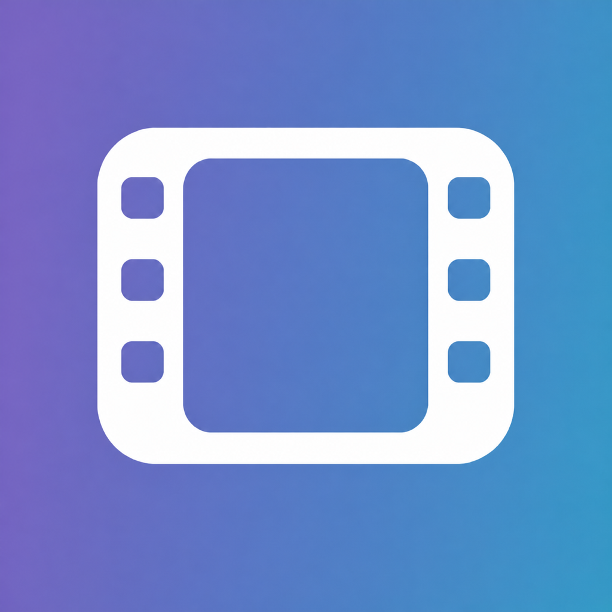

<h1> OnDevice Film Lab</h1>

## [Open OnDevice Film Lab](https://nikunjsingh93.github.io/ondevice-film-lab/)

## Install the app

Install OnDevice Film Lab from the live link above. Once it has loaded successfully, the installed app can open and process photos without an internet connection.

### iPhone and iPad

1. Open the app link in **Safari**.
2. Tap the **Share** button.
3. Tap **Add to Home Screen**. If it is hidden, scroll down, tap **Edit Actions**, and add it.
4. Turn on **Open as Web App**, then tap **Add**.

### Android

1. Open the app link in **Chrome**.
2. Tap the three-dot menu.
3. Tap **Install app** or **Add to Home screen**.
4. Confirm the installation.

### Mac

**Safari on macOS Sonoma 14 or later:** open the app link, choose **File → Add to Dock** (or **Share → Add to Dock**), then click **Add**.

**Chrome:** open the app link, click the install icon in the address bar. If it is not shown, choose **More → Cast, save, and share → Install page as app**, then confirm.

### Windows

**Microsoft Edge:** open the app link, click the app-available icon in the address bar. Alternatively, choose **Settings and more → More tools → Apps → Install this site as an app**.

**Chrome:** open the app link, click the install icon in the address bar. If it is not shown, choose **More → Cast, save, and share → Install page as app**, then confirm.

OnDevice Film Lab is a private, browser-based photo processor. It softens harsh digital sharpening and halos, adds film-inspired fade, bloom and grain, provides a side-by-side comparison, and exports finished photos without uploading them to a server.

## Features

- Processes photos locally on your device
- Imports individual photos or an entire DCIM folder
- Supports JPEG, PNG, and WebP input
- Adjustable de-sharpen strength, halo radius, and edge threshold
- Old-film fade with adjustable strength, set to 30% by default
- Diffusion-style highlight bloom inspired by black-mist filters, set to 30% by default
- Film grain enabled by default, with adjustable strength, size, and roughness
- Original-versus-edited comparison preview
- Preview zoom from 50% to 400%, with reset and drag-to-pan close inspection
- Manual rotation with orientation baked into exports
- Left and Right Arrow navigation between photos
- Retro segmented date stamp enabled by default, with selectable date formats and a soft orange film-like glow
- Capture-date filenames such as `20260809_124041_FilmLab.jpg`
- Individual JPEG downloads or **Download all .zip** batch export
- Responsive layout for phones, tablets, and desktop browsers
- Lightroom-style mobile tool bar, settings sheets, and hamburger import menu
- Fixed desktop editing workspace that keeps the preview and filmstrip visible
- Whole-app fullscreen mode
- Installable PWA with offline access after the first successful load

## Privacy

Your photos never leave your browser. Processing and exporting happen locally on your device, with no account, upload, or cloud service required.

## How to use

1. Open the [web app](https://nikunjsingh93.github.io/ondevice-film-lab/).
2. Choose individual photos or select a folder.
3. Adjust the softening, fade, bloom, and optional film-grain controls, then compare the original with the processed preview.
4. Optionally rotate photos, rename them using their capture dates, or add a film date stamp.
5. Save the selected photo or download the entire batch as a ZIP file.

## Browser compatibility

OnDevice Film Lab works in modern versions of Safari, Chrome, Edge, and Firefox. Folder selection and download behavior can vary by browser and operating system. For large batches on older phones, process fewer photos at a time if memory is limited.

## Run locally

Download or clone this repository. You can open `index.html` directly for basic use, with no installation or build process. To test PWA installation and offline support, serve the repository through `localhost` because browsers do not enable service workers for files opened directly from disk.

For example, from the repository folder:

```sh
python3 -m http.server 8000
```

Then open `http://localhost:8000` in a modern browser.

## License

Released under the [MIT License](LICENSE).
